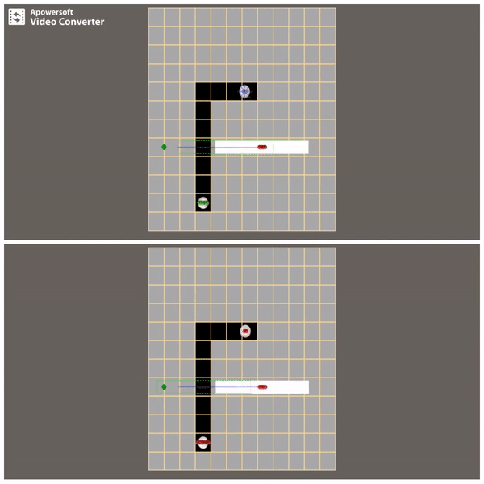

# Cooperative Pathfinding in Unity (C#)

This program implements cooperative pathfinding as proposed by David Silver [here](http://www0.cs.ucl.ac.uk/staff/D.Silver/web/Applications_files/coop-path-AIWisdom.pdf).

The cooperation between agents is substituted by a system for predicting the path of nearby obstacles.

The result is agent movement that takes the future obstacle positions into account. 

## Getting Started

If you're just interested in the code you'll find all the classes [here](CooperativePathfinding/Assets/Scripts).

I have made the program in [Unity 3D](https://unity3d.com/) game engine, because it allowed me to test my implementation easier.

If you wish to try it out yourself you may take the classes and refactor them a bit to work in your environment, or you can open the project with Unity. The easiest way to do so would be so go to the CooperativePathfinding/Assets/Scenes/Testing folder and run TestScene with Unity.

Then pressing the play button at the top-center of the window is all you need to do to test it. 

To make a custom level you can supply a .txt file to the Grid gameobject. And you can also try the local avoidance implementation by toggling isLocalAvoidance in the Manager gameobject.

This is a comparison between using local avoidance (upper scene) and cooperative pathfinding (lower scene): 

### Prerequisites

The Unity version I was using is 2018.3.6f1 Personal, but I used mostly basic things so I think it should work in most of the newer versions.

## License

This project is licensed under the MIT License - see the [LICENSE.md](LICENSE.md) file for details
